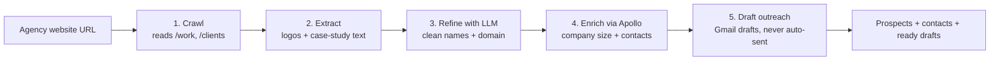

# Agency to Prospect Pipeline

**The problem.** If you're a company trying to steal your competitor's clients, there's an obvious wall: you don't know who those clients are. Nobody publishes that list. So you can't pitch them.

**How I ended up building it.** I cold-emailed a YC-backed startup called Uplane and said: give me a real problem, I'll solve it in 48 hours, no meeting. The founder had a product fresh out of the oven with zero customers. His plan was to go after the clients of the marketing agencies he was competing with, since those companies already pay for exactly what he does. One catch: he had no idea who those clients were. So that became the problem. Find them.

**How long it took.** 27 hours, start to finish. Idea to deployed.

**Stack.** Python, HTML, Gmail OAuth, OpenAI API, Apollo.io API.

## What it actually does

You feed it a competitor agency's website. It crawls the site and rips the client brands out of the logos and case studies. Those names come out messy, so the LLM cleans them into real companies with real domains. Then Apollo enriches each one, company size, the actual decision-makers, their emails. Finally it writes a 3-step outreach sequence and drops it into Gmail as drafts. It never sends anything on its own, a human still has to hit the button.

## Reference images

Step 1: Paste your competitor's website URL

Step 2: You'll see the list of clients. Click any of them to view the decision-makers to reach out to

Step 3: View the list of decision-makers, their LinkedIn, and a send-email CTA. Click send to drop it into your email drafts 

Step 4: View / edit / send the outreach from your drafts 

## The thing that stuck with me

Here's what I didn't expect. Apollo crushed it on the big, visible companies, instant, full profile, every contact. On the small ones the crawler dug up? Nothing. Blank. "Not available."

And that's the whole game, isn't it. The companies that are easy to find are the ones everyone's already fighting over. The ones worth finding are the ones the standard tools can't see. I only really got that by watching my own thing hit the wall.

---

Built solo and fast. No brief, no salary, just a problem I couldn't put down.
