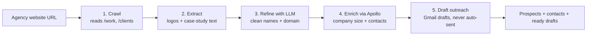

# Agency to Prospect Pipeline

I built this in ~27 hours for the founder of a YC startup who gave me a live problem instead of an interview: his company replaces marketing agencies, so he wanted to find companies that already work with an agency, since those are the ones he can win. "Set it up, and if I like it, I offer you a job."

Give it a marketing agency's website. It works out who that agency's clients probably are, enriches the real ones, and drafts the outreach.

## How it works

The LLM is the cleanup step, not the brain. The scraping is deterministic (alt-text, logo filenames, headings); the model just turns messy scraped names into clean company names and a best-guess domain.

## The thing I actually learned

Apollo is great until it isn't. On a big, digitally-visible company it came back instantly with the full picture. On the smaller prospects the crawler surfaced, it just returned "not available": no domain, no contacts, nothing.

That gap is the whole problem. The companies that are easy to enrich are the ones everyone's already chasing; the interesting ones are invisible to the standard data tools. Watching my own pipeline hit that wall is the most useful thing I got out of building this.

## Stack

Python / Flask, SQLite, OpenAI (name cleanup), Apollo.io (enrichment), Gmail OAuth (drafts). Server-rendered, no frontend framework. I was moving fast, not building to last.

## Running it

    pip install -r requirements.txt
    cp .env.example .env
    python app.py

Heads up: the enrichment step needs a paid Apollo tier, the people-search endpoints don't work on free. The crawl-and-extract half runs without it.

## What's rough (on purpose)

I'd rather be honest about the seams than pretend this is finished:

- The confidence scoring exists but the UI doesn't use it yet. The scraper scores every candidate, then the LLM step flattens it and I treat all prospects equally. It's wired to become a ranking, I just didn't get there in 27 hours.
- I cut a feature I'd built. The founder's "A-star" ask was scraping each brand's Meta ad-transparency page ID. I built a version that guessed the ID with the LLM, but a guessed ID silently onboards the wrong brand, so I pulled it. Doing it right means resolving the real ID from Meta, not guessing.
- Some Apollo response-shape handling is defensive guessing against a messy API.

## What I'd build next

A social-surfacing step: before writing the outreach, pull the prospect's recent news and blog activity, find where it connects to what the sender actually offers, and work that specific hook into the email. Relevance beats volume, anyone can send 3,000 generic emails; the point is the one line that proves you actually looked.

---

Built solo, fast, for real, by Sam Richard.
